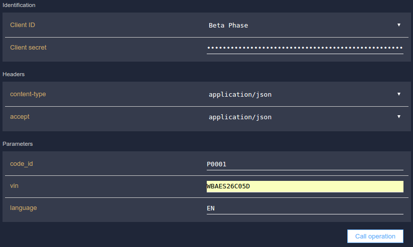
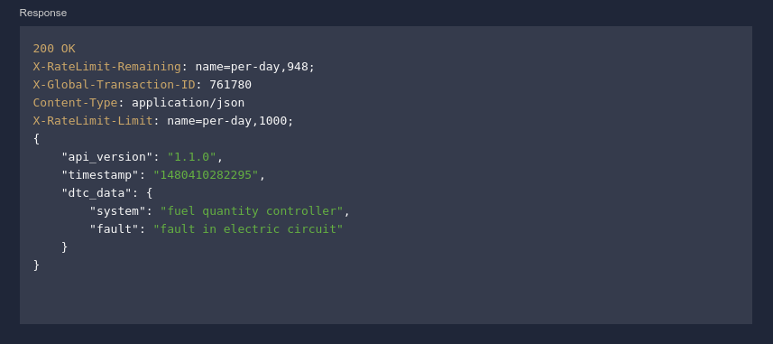
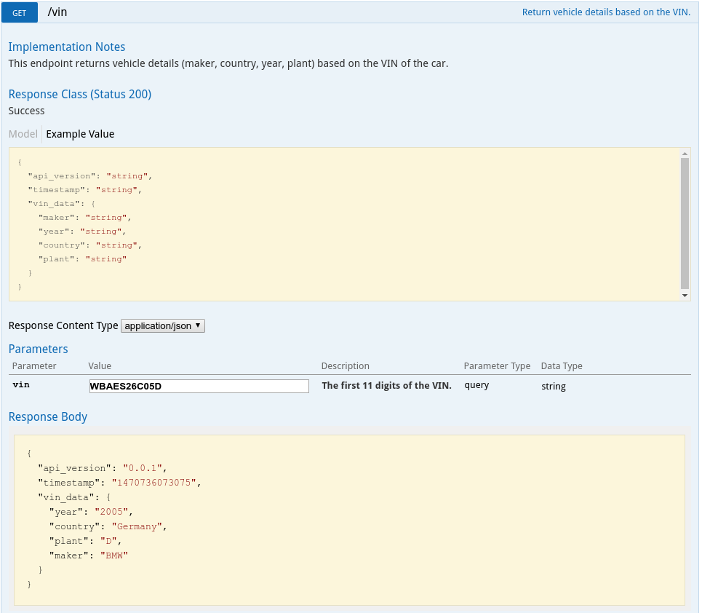

# Car Diagnostic API - Documentation

## 0. How to get started quickly
The main functionality of the to translate error codes from a car into a form
that everybody can understand. Here's an example call:

``` shell
curl --request GET --url 'https://api.eu.apiconnect.ibmcloud.com/hella-ventures-car-diagnostic-api/api/v1/dtc?client_id=8c0be540-4a9f-44ab-a7a9-4665e0c4c698&client_secret=P7sT3sK2qE2oL5aQ5nF0jH7xB3bO8cA2uB2kS0gM7bY8rL7lN5&code_id=P0001&vin=WBAES26C05D&language=EN' --header 'accept: application/json' --header 'content-type: application/json'
```

As a result of this call you get the following json object:
``` json
{"api_version":"1.1.0",
 "timestamp":"1485273802071",
 "dtc_data": {
   "system":"fuel quantity controller",
   "fault":"fault in electric circuit"
   }
}
```

Please feel free to try out this example call in your command line.

For the example you specify the following input data:
- client_id: your username (required)
- client_secret: your password (required)
- code_id: the error code from the car (required)
- vin: the first 11 digits of the vehicle identification number (required)
- lang: the language the error code should be translated to (required)

As an output of this call you get the following data:
- api_version: the current version of the API
- timestamp: the Unix timestamp of the API-call
- system: the system in the car where error is located
- fault: the type of error in this system


## 1. Overview
This API can help you to assess the health status of a vehicle, by translating
OBD error codes in a human readable form. This service is of great interest for
various companies, e.g., IoT/Automotive startups, fleet management providers,
booking platforms and taxi companies. We support all error codes that can be
read with the widely used ELM327 OBD dongles. In addition to that, we also
support error codes that are specific to car manufacturers. Our database
includes more than 17.000 error codes that are professionally maintained.
The API can be accessed via IBM Bluemix - you can get access to it under the following link:

https://console.eu-gb.bluemix.net/catalog/services/car-diagnostic-api/

In section 2 below you can find detailed instructions on how to get access to
this API.

Apart from the API itself, we will also provide iOS and Android Example Apps
for developers, which explains the API usage and includes additional convenience
features like establishing a bluetooth connection between the smartphone and the
OBD dongle, determining the correct OBD protocol and requesting error codes from
the car. These Apps are available under the following links:

- [iOS OBD Example App](https://github.com/HellaVentures/iOS-OBD-Example-App)
- [Android OBD Example App](https://github.com/HellaVentures/Android-OBD-Example-App)

## 2. Getting Started
This API assumes that you already know how to read error codes from the OBD port
of a car. The example Apps that we mentioned above can show you how
to do this in Android and Swift.

To get up and running quickly with this service, follow these steps:

1. In the "Bluemix catalog", go to the "Internet of Things" section and click on
   the "Car Diagnostic API" tile.
2. On the next page, click on the "Register at Car Diagnostic API" link.
3. The next page is the IBM Developer Portal of this API. On this page, click on
   the "Login" link in the top right. The first time you log in, you are asked
   to create a new Developer Organization (e.g. my-dev-org).
4. Next, go to "Apps" and click on "Create new App".
5. Enter a title for the App and a description (optional) and click on "Submit".
6. Write down your Client Secret and your Client ID. These are the
   username/password that you will use to access the API. **Note that the Client
   Secret is displayed only once on this page.** The Client Secret is located at
   the top of the page and the Client ID on the bottom - you need to click the
   checkboxes to make them visible
7. Go to "API Products" and click on the version of the "Car Diagnostic API"
   that you would like to use. Note that after a new version of the API was
   released, the older version will be maintained for three months. After this
   period your account will be migrated to the most recent version.
8. Next, choose a plan and click on "Subscribe". In the next pop-up window
   select an App and click on "Subscribe".
9. Go to the "Car Diagnostic API" section on the left side of this page. There
   you can try out the API and get instructions on how to call the API  - these
   include the URL for calling the API. If you want to make a test-call of the
   API, you can go to the Operation "GET /dtc" and enter the following example
   data:
   
   
   
   Note that you have to put in the your own Client secret, which you have
   written down before.
   In addition you can find here coding examples in different programming
   languages that exemplify how to call the API. Note that the Client ID and
   Client Secret need to be passed to the API as query parameters for
   authentication. 

When you go back to the initial Bluemix screen of the Car Diagnostic API, you
can enter the Client ID and Client Secret in the corresponding fields. If you
have not also bound your service instance, you will have to bind your new
service instance to one or more Bluemix applications. Once the Bluemix
applications have been restarted or restaged, the Car Diagnostic API Client ID
and Secret will be available within the application's VCAP_SERVICES environment
variable.


## 3. Features

The API is built in a Restful way and returns JSON objects as a response. Input
parameters are passed to the API inside the URI. This API provides two main
features:

- Diagnostic Trouble Code (DTC) translation
- Vehicle Identification Number (VIN) decoding.

The DTC translation is available on the `/dtc` endpoint. As an input you need to
provide the 5-digit error code as it is returned from the OBD dongle (e.g.
P0001), the first 11 digits of the VIN and a language (EN or DE). As an output
you get the system in the car where the error is located and a description of
the fault. An example call to this endpoint can be seen in the following figure.



A list of all supported car makers is available on the `/dtc/maker` endpoint and
a list of all supported languages can be seen on the `/dtc/langs` endpoint.

The VIN decoding is available on the `/vin` endpoint. As an input you need to
provide the first 11 digits of the VIN. As an output you get the car maker, the
country name and the production year. An example call to this endpoint can be
seen in following figure.




## 4. Feedback and Support

If you want to file a bug report or make a feature request for the API, please
use the issues section of this repo. For bug reports and feature request for the
iOS and Android Apps, please use the issues sections in the corresponding repos.

## 5. Legal Notice
The terms and conditions for our service can be found in the
[TERMS](https://github.com/HellaVentures/Car-Diagnostic-API/blob/master/TERMS) file of this
repo.

Please note that not all car makers are covered by this API. Moreover, some
OEM-specific DTCs are covered by this API, but certainly not all of them.
